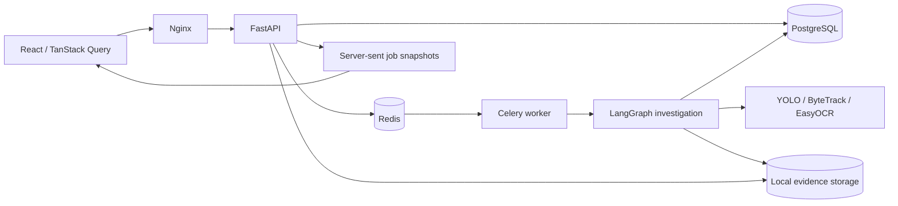

# Architecture

`apps/api` handles bounded uploads, configuration, status, evidence delivery and append-only reviews. Sync endpoints run in FastAPI's thread pool. SSE uses asynchronous waiting and moves database reads to that pool. Video inference runs outside the API in a single-process-per-job worker. PostgreSQL stores videos, jobs, cameras, tracks, incidents, plate readings, evidence assets and reviews. JSON columns preserve calculated observations and a versioned report.

`packages/vision` handles media validation, normalization, detection and image quality. The expensive model is loaded once per worker; its tracker is reset between videos. Detection and ByteTrack execute together on time-sampled frames, sequentially to preserve tracking state. Inference currently uses individual samples rather than batch inference. Original frame indices and normalized video timestamps are retained.

`packages/tracking` calculates movement with a one-second baseline and handles gaps. `traffic_analysis` detects persistent queues per region. `cause_attribution` ranks candidates with corroboration gates. `plate_recognition` runs a separate YOLO plate detector followed by EasyOCR on candidate vehicles only. `workflows` coordinates these stages through an actual LangGraph StateGraph with conditional branches.

## Persistence and retries

The worker writes a tracking checkpoint using an atomic temporary-file replacement, records its pointer in the job, and reuses it on retry. Normalization is similarly reused. Other deterministic stages replay from the tracking checkpoint; this is stage replay, not a durable LangGraph checkpointer at every node. Timings and progress persist in SQL. Replayed evidence replaces unreferenced outputs. A completed job is idempotent. PostgreSQL advisory locks prevent concurrent execution of the same analysis job. Celery uses late acknowledgement, one prefetched task per worker, and broker visibility timeout longer than the task deadline.

Uploads preserve their original file under a random UUID directory. Each analysis has its own normalized MP4 and artifacts; its report uses an analysis-scoped media URL. Camera configuration and threshold values are snapshotted into the job, so later edits do not silently change a previous result. Model checksums and configuration version appear in reports.

## Extending the system

- Implement `DetectorTracker` to replace detection/tracking. The implementation must return measured `Observation` records.
- Implement `CauseDetector.category()` and register it in `DETECTORS` for new evidence-backed cause categories. Unsupported classes never become fake detections.
- Implement the `OCR` protocol for another open-source engine.
- Replace `LocalStorage` through its storage boundary with encrypted object storage for hosting.
- Optional narrative generation can consume structured reports, but no LLM is configured or called. Numerical analysis remains deterministic.

The current application is a local single-user workspace. Authentication, tenant isolation, distributed rate limiting and object-storage authorization are required before a multi-user deployment. The Compose frontend binds only to loopback.
